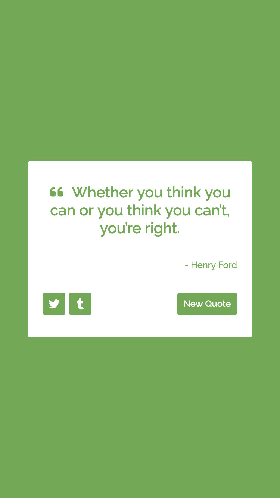
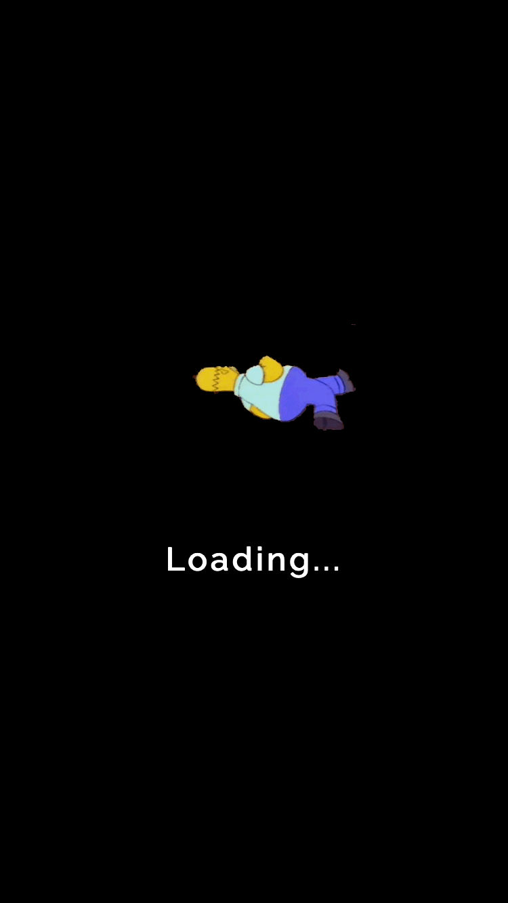
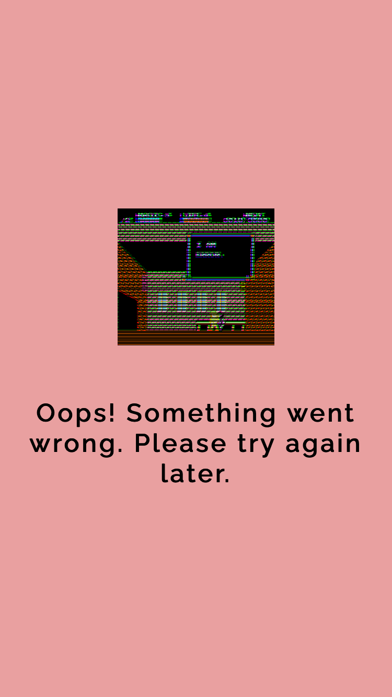
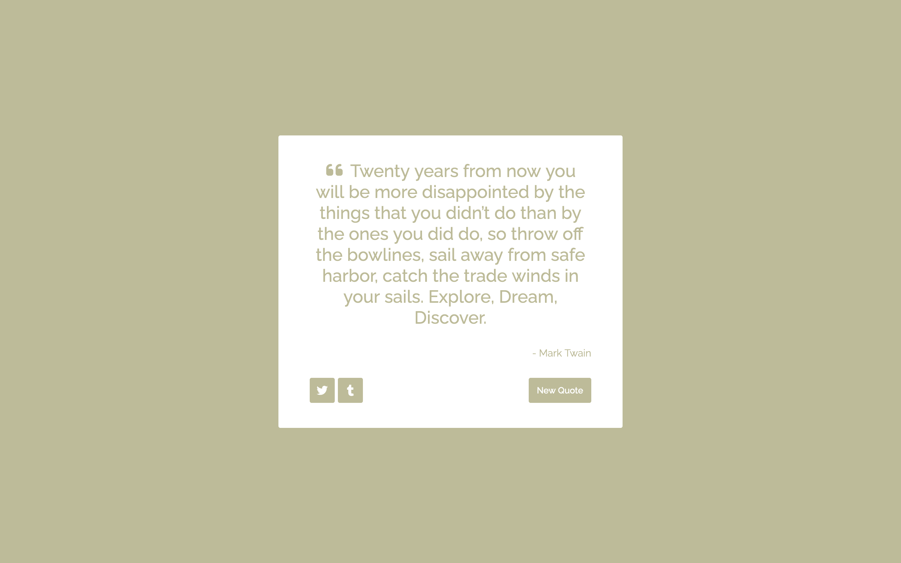

# freeCodeCamp - Random Quote Machine Solution

This is a solution to the [Build a Random Quote Machine challenge on freeCodeCamp](https://www.freecodecamp.org/learn/front-end-development-libraries/front-end-development-libraries-projects/build-a-random-quote-machine).

## Table of contents

- [Overview](#overview)
  - [The challenge](#the-challenge)
  - [Screenshot](#screenshot)
  - [Links](#links)
- [My process](#my-process)
  - [Built with](#built-with)
  - [What I learned](#what-i-learned)
  - [Continued development](#continued-development)
  - [Useful resources](#useful-resources)
- [Author](#author)

## Overview

### The challenge

Users should be able to:

- View the optimal layout for the site depending on their device's screen size
- Get random quote by clicking New Quote Button
- Change theme color when displaying new quote
- Share quotes to Twitter and Tumblr

### Screenshot

<table>
  <tr>
    <td>
      
      
      
    </td>
  </tr>
  <tr>
    <td>
      
    </td>
  </tr>
</table>

### Links

- Live Site URL: [here](https://zun-liang.github.io/fcc-random-quote-machine/)

## My process

### Built with

- Semantic HTML5 markup
- CSS custom properties
- Flexbox
- Mobile-first workflow
- [React](https://reactjs.org/) - JS library
- [Styled Components](https://styled-components.com/) - For styles

### What I learned

- How to add socail media share button and how to set up sharing url

### Continued development

- currently reviewing basic React (class & functional), styled-components, working with APIs...
- plan to learn advanced React (reusability, performance, routing...) in the next month or two
- plan to learn React Native and Next.js after step 2
- plan to learn GraphQL and Jest after step 3

### Useful resources

- [Tweet button](https://developer.twitter.com/en/docs/twitter-for-websites/tweet-button/overview)
- [Tumblr Share Button Documentation](https://www.tumblr.com/docs/en/share_button)
- [CSS Transitions explained](https://www.freecodecamp.org/news/css-transitions-explained-d67ab9a02049/#:~:text=Transitioning%20two%20or%20more%20properties,to%20specify%20one%20of%20them.)
- [Understanding the Difference Between Named and Default Exports in React](https://betterprogramming.pub/understanding-the-difference-between-named-and-default-exports-in-react-2d253ca9fc22)

## Author

- Website - [Zun Liang](https://zunldev.com/)
- GitHub - [@zun-liang](https://github.com/zun-liang)
- Frontend Mentor - [@zun-liang](https://www.frontendmentor.io/profile/zun-liang)
- freeCodeCamp - [@zun-liang](https://www.freecodecamp.org/zun-liang)
